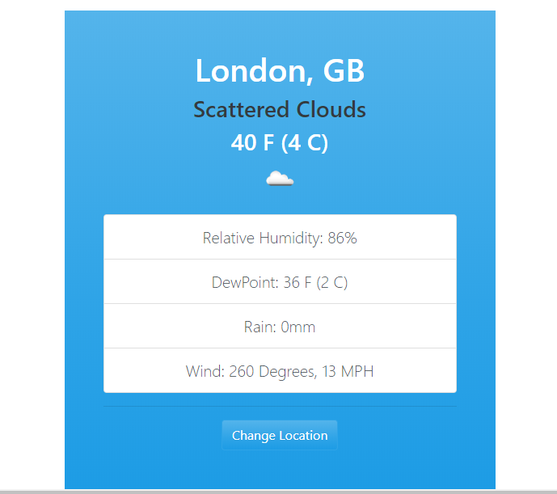

# Weather-App

An application for getting location base weather information.Created Vanilla JavaScript ES6, OOP.

### Weather info data was fetched from "Openweathermap" API using async-await.It also have a localStorage so the data will not go after load or if the browser closed.

## Have to use a local server or editors live server to work correctly.

